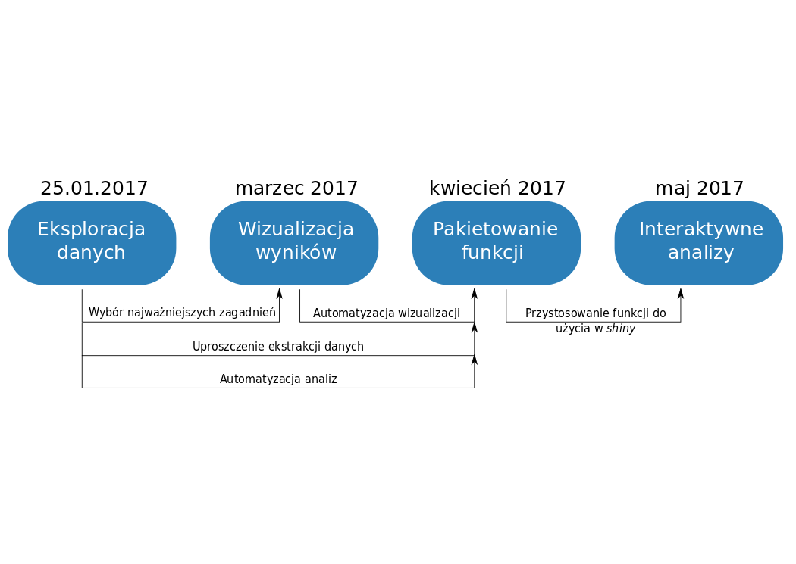

# O STWURze

## Cel

- Poznać lepiej różnice między Wrocławiem/Dolnym Śląskiem i innymi regionami Polski.
- Z każdego spotkania wyjść wiedząc przynajmniej jedną użyteczną rzecz więcej.

## Forma spotkań

- Prelekcja wprowadzająca (15 min).
- Praca zespołowa (1.5 h).
- Prezentacja wyników (15 min).

## Cykl spotkań

# Diagnoza społeczna

## O Diagnozie

- Całościowe dane na temat gospodarstw domowych w Polsce.
- Dane ekonomiczne (dochód, kredyty) i socjologiczne (edukacja, styl życia).
- Badania prowadzone od 2000 do 2015 r.
- Małe duże dane (3523 zmienne, 84478 rekordy).

## Wyzwania

- Przypisanie zmiennych do kategorii.

