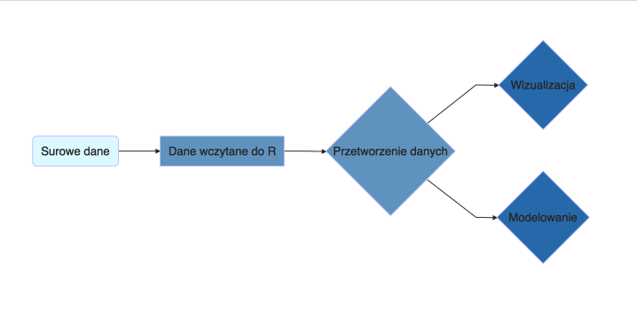

---
output:
  revealjs::revealjs_presentation:
    self_contained: false
    incremental: true
    css: report.css
    reveal_plugins: ["zoom"]
---

## {data-background="img/banner.png"} 

<h1>Eksploracja danych</h1>

<h2>Michał Burdukiewicz, Piotr Sobczyk<h2>

<h3>25 stycznia 2017<h3>

# O STWURze {data-background="img/banner.png"} 

```{r echo=FALSE}
library(knitr)
opts_chunk$set(tidy.opts=list(width.cutoff = 50), tidy=TRUE)
```

## Cel

- Stworzenie społeczności użytkowników R we Wrocławiu/na Dolnym Śląsku.
- Rozpowszechnianie znajomości eRa, poszerzanie programistycznych (i nie tylko) horyzontów
- Poznawanie Wrocławia, Dolnego Śląska i Polski od strony danych

## Forma spotkań

- Prelekcja wprowadzająca (15 min).
- Praca zespołowa (1.5 h).
- Prezentacja wyników (15 min).

## Cykl spotkań


## Jak uczestniczyć?

- Brać udział w spotkaniach.
- Dzielić się swoją wiedzą.
- Opowiadać znajomym o STWURze

# Diagnoza społeczna {data-background="img/banner.png"} 

## O Diagnozie

- Całościowe dane na temat gospodarstw domowych w Polsce.
- Dane ekonomiczne (dochód, kredyty) i socjologiczne (edukacja, styl życia).
- Badania prowadzone od 2000 do 2015 r.
- Małe duże dane (3523 zmienne, 84478 rekordy).

## Wyzwania

- Kategoryzacja zmiennych
- Znalezienie podobnych pytań występujących w kolejnych latach
- Wizualizacja i modelowanie

# Eksploracja danych {data-background="img/banner.png"} 

## Rozpoczęcie pracy

Kody: http://tinyurl.com/stwur01

```{r eval=FALSE}
install.packages(c("ggplot2", "dplyr"), repos = "https://cloud.r-project.org/")
download.file(url = "https://github.com/michbur/Diagnoza_dane/archive/master.zip", 
              destfile = "diagnoza.zip")
unzip("diagnoza.zip", exdir = getwd())
load("./Diagnoza_dane-master/osoby.RData")
load("./Diagnoza_dane-master/osobyDict.RData")
```


## Jak wydobyć informacje z danych?



## Przykłady ciekawych zmiennych w badaniu diagnozy:

* Co jest według Pana ważniejsze w życiu? (*fp29*)
* Czy czuje się Pan osamotniony, mimo że tego nie chce? (*fp42*)
* W jakim stopniu zadowolony jest ze stanu bezpieczeń (*fp63_16*)
* zauf.sądów (*fp98_11*)
* słuchanie muzyki lub radia przez internet (*fp12818*)

# Podsumowanie {data-background="img/banner.png"} 

## Sponsorzy

* Doktoranckie Koło Naukowe Bioinformatyki,
* Uniwersytet Wrocławski,
* Krajowy Naukowy Ośrodek Wiodący Wrocławskie Centrum Biotechnologii.

## Ważne informacje

<h3>Kody: http://tinyurl.com/stwur01 </h3>

<h3> Ankieta: http://tinyurl.com/stwur-ankieta </h3>

<h3> Wyniki (zamiennie): </h3>

* fork repozytorium https://github.com/michbur/STWUR-01-2017 do katalogu **results**,
* wysłać na kontakt@stwur.pl